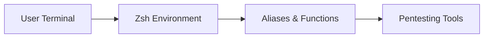

# 🔥 Kali Hacker Terminal

Automated offensive terminal environment for **Kali Linux**, designed to streamline real-world pentesting workflows and standardize a reproducible Red Team setup.

---

## 🏷️ Badges


---

## 📑 Table of Contents

1. [Project Description](#project-description)
2. [Architecture](#architecture)
3. [Execution Flow](#execution-flow)
4. [Pipeline CI/CD](#pipeline-cicd)
5. [Onboarding](#onboarding)
6. [Features](#features)
7. [Usage](#usage)
8. [Scripts](#scripts)
9. [Checklist Final](#checklist-final)
10. [Additional Documentation](#additional-documentation)
11. [Disclaimer](#disclaimer)

---

## 📘 Project Description

* **Project type:** Offensive terminal environment
* **Platform:** Kali Linux
* **Stack:** Zsh, Bash, Powerlevel10k
* **Objective:** Optimize pentesting workflows and automate repetitive tasks
* **Environment:** Local (Kali Linux)

💡 DevOps mindset:
This environment is reproducible, modular and designed to be deployed quickly in lab or real-world pentesting scenarios.

---

## 🧱 Architecture



📌 Description:

* User interacts through Zsh
* Custom aliases and functions speed up operations
* Integrated tools are executed efficiently

---

## 🔄 Execution Flow


---

## 🚧 Pipeline CI/CD

This project currently does not include a CI/CD pipeline.

Future improvements may include:

* Automated environment validation
* Configuration testing
* Integration with provisioning tools

---

## 🚀 Onboarding

```bash
# One-line installation
curl -fsSL https://raw.githubusercontent.com/D4NYED/kali-hacker-terminal/main/install.sh | bash
```

📌 This installs and configures the full environment automatically.

---

## 🛠️ Features

### ⚡ Terminal Optimization

* Zsh + Powerlevel10k
* Improved terminal visibility
* Faster navigation

---

### ⚙️ Automation

* Custom aliases for pentesting tasks
* Functions for:

  * Reverse shells
  * Encoding (Base64, URL)
  * SUID binary search
  * Hydra usage shortcuts

---

### 🧰 Productivity

* `mkcd` → create and enter directory
* `extract` → extract compressed files
* Quick navigation shortcuts

---

## ⚙️ Usage

Once installed:

```bash
zsh
```

📌 The environment is automatically loaded with all configurations.

---

## 🛠️ Scripts

* `install.sh` → Automated environment setup
* `zshrc` → Configuration file
* `banners/` → Terminal banners

---

## ✅ Checklist Final

* [ ] README updated
* [ ] Installation tested
* [ ] Aliases working correctly
* [ ] Functions validated
* [ ] Environment reproducible

---

## 📚 Additional Documentation

* `install.sh` → installation logic
* `zshrc` → configuration details
* `banners/` → visual customization

---

## ⚠️ Disclaimer

This project is intended for:

* Educational purposes
* Authorized pentesting
* Security research

Unauthorized use may be illegal.

---

## 👤 Author

Daniel Espinosa Delgado (D4NYED)
Pentester Junior · Automation · Red Team

* LinkedIn: https://www.linkedin.com/in/d4nyed
* Twitter/X: https://twitter.com/D4nYeD
---

© 2026 D4NYED


